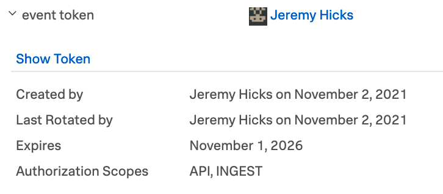
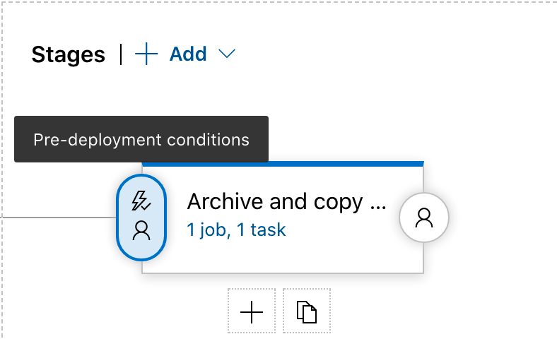
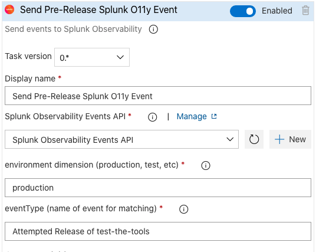

# azure-devops-splunk-observability-cloud-events
Add events to Splunk Observability Cloud from Azure DevOps Deploy and Release Pipelines.

## Setup your Service Connection
After installing the Splunk Observability Cloud Events extension you will need to setup 
your Service Endpoint 
1. Click Project Settings from the bottom left side of your screen in the main Project area
2. Click Service Connections from the Pipelines area of Project Settings
3. Click New Service Connection in the top right
4. Choose the Splunk Observability Service Endpoint as your new service connection
5. Enter your Splunk Observability Cloud Ingest API token which you obtained from Splunk Observability Cloud > Access Tokens. Make sure the token is scoped for API and Ingest 

## Setup your Build Pipeline Job to emit an event
Once your Service Connection is setup you can start setting up your Pipeline to emit events when it is run.
1. Edit your Pipeline to view its YAML configuration
2. If you are not already using a Multi-Job Pipeline configure the appropriate `jobs:` and `-job:` tags and formatting. See the [Azure DevOps Docs](https://docs.microsoft.com/en-us/azure/devops/pipelines/process/phases?view=azure-devops&tabs=yaml#multi-job-configuration) for details.
3. Add the configuration for your Splunk Event. You can either search for `Splunk` in the Tasks sidebar or add the appropriate YAML
    ```
      - job: notify_splunk
        pool: server

        steps:
        - task: Splunk@0
          inputs:
            SplunkService: 'Splunk'
            environment: 'production'
            eventType: 'Azure DevOps deployment of test-the-tools'
    ```
    - The `eventType` will be the title of your event in Splunk Observability Cloud and will be used to match the event later for visualizing as an overlay on charts/dashboards.
4. Save your pipeline

## Setup your Release Pipeline to emit an event
1. Edit your Release Pipeline by clicking Releases under the Pipeline heading in the left sidebar
2. Select your Release Pipeline and click the Edit button in the upper right
3. Click either Pre-Deployment or Post-Deployment conditions 
    
4. Enable Gates and click Add to add your Splunk Events configuration
    
    - Choose `Ignore gates outcome and ask for approvals` to ignore any waiting for the release gate and just send the event without confirmation